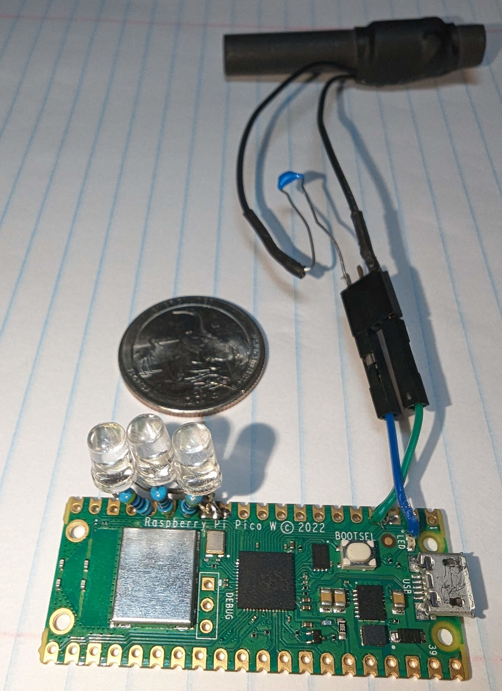
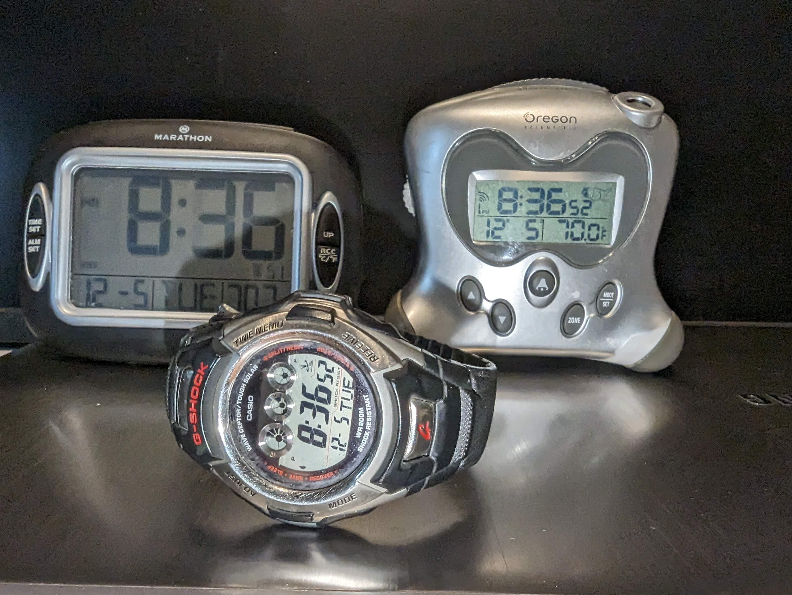
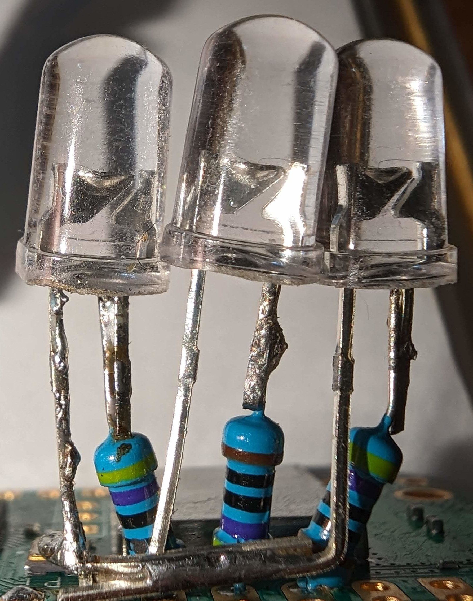
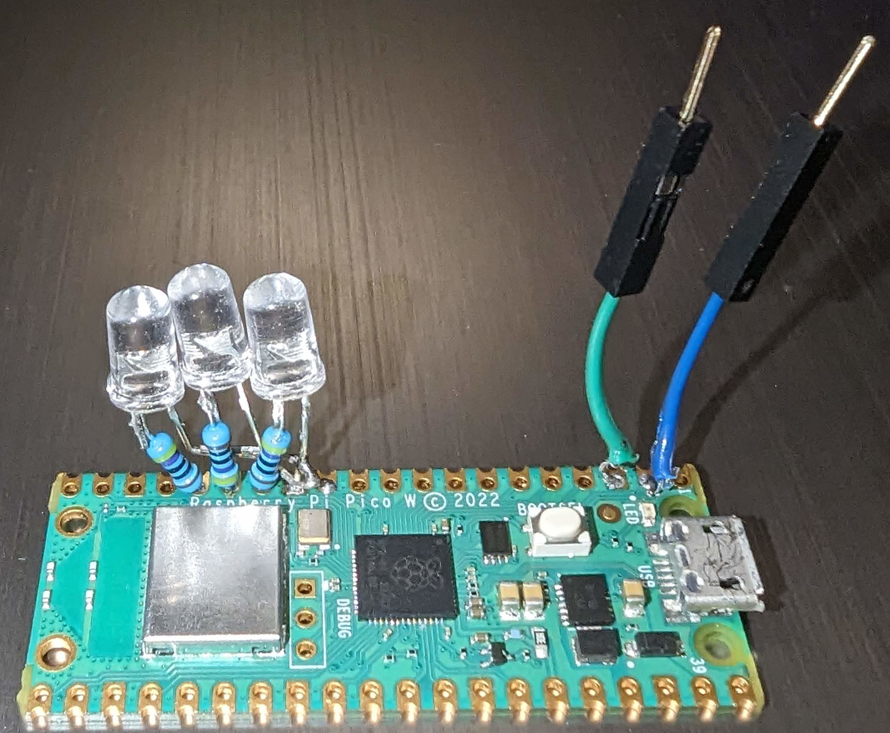

# pico wwvb

Pico wwvb is a single board computer which gets the time via NTP and transmits a WWVB signal to synchronize radio controlled clocks. It uses the [Raspberry Pi Pico W](https://www.raspberrypi.com/documentation/microcontrollers/raspberry-pi-pico.html).

This is a simplification of a previous project which used GPS to obtain the time.  See [micro-wwvb](https://github.com/chgenly/micro-wwvb).  No PC board has to
be fabricated, many fewer components to solder, and no worries about whether or
not you can receive GPS inside a house.


PICO W with antenna 

## The Radio Controlled Clocks

I have three radio controlled clocks.

- Marathon
- Oregon Scientific
- Casio 2688 Watch

I can set all three clocks with the pico-wwvb board.  The marathon always synchs. So this is the one I tested with the most and it assured me that the wwvb signal was correct. The Oregon Scientific syncs some of the time.  The watch synchronizes infrequently and has to be right next to the antenna.  Although the watch does seem
to sychronize at night when it initates its automatic sync.  So I can call the
project a success.



## The lights

There are three leds used to report status of the board. These LEDs should be interpreted as a binary number.  The most significant bit is the leftmost one (as seen in the pictures of the board above). This table indicates the displayed values.

| *Display* | *Meaning*                                    |
| --------- | ---------                                    |
| Rapidly flashing 7 through 0 | This is the 8 second startup countdown. Counting down from 7 to 0.
| 1 | The state structure has been allocated               |
| 2 | The WIFI subsystem has been initialized              |
| 3 | A UDP receive handler was setup.                     |
| 4 | WIFI login was successful                            |
| 5 | A DNS response for the time server has been received |
| 6 | NTP time received                                    |

The pico's built-in led is used to show when the WWVB signal is sending at high power.  So it changes once a second.

If the LEDs are slowly flashing, then an error has occured.  Lookup the number in the table above to understand which step failed.

The startup delay is to give the user time to start a terminal, such as putty, to look at serial output over the USB port.

## Windows Development environement

### Environment variables

You have to set two environment variables. WIFI_SSID and WIFI_PASSWORD. These are the ssid and password used by the pico's cygw43 chip to login to your wifi network.  The cmake file will refuse to build pico-wwvb until you set these.

### Raspberry pi pico SDK

As described in [Getting Started With Raspberry Pi Pico](https://datasheets.raspberrypi.com/pico/getting-started-with-pico.pdf?_gl=1*1nfvcz8*_ga*MzMwNzAxMjUzLjE3MDExNDE3NTA.*_ga_22FD70LWDS*MTcwMTE5ODg2Mi4zLjEuMTcwMTIwMDY5Ny4wLjAuMA..)

Download the latest
release of [Pico setup for windows](https://github.com/raspberrypi/pico-setup-windows/releases/latest/download/pico-setup-windows-x64-standalone.exe)
and run it.

In your Start Menu, look for the *Pico - Visual Studio Code* shortcut,
in the *Raspberry Pi Pico SDK \<version\>* folder. The shortcut sets up
the needed environment variables and then launches Visual Studio Code.

Clone the pico-wwvb project from github, then open pico-wwvb folder in vscode.

Install the cmake extensions.

## To Build from source

Open the cmake view.  In the project outline find pico-wwvb and click the build icon on the right side of that line.

There is also a test_dow you can run which tests the day of week code.

## Parts

| Name                |Price| URL                      |
| ------------------- | ------ | --------------------- |
| CANADUINO® 60kHz Fine Tuned Loop Stick Antenna for Atomic Clock Receiver    | $4.99  | [amazon](https://www.amazon.com/CANADUINO-60kHz-Antenna-Atomic-Receiver/dp/B07PK7WJYR/ref=sr_1_1?crid=11EAPWFGVDHZ2&keywords=60khz+antenna&qid=1697772066&s=electronics&sprefix=60khz+antenn%2Celectronics%2C154&sr=1-1) |
| male to female pin cables (20)	| $2.10 | [digikey](https://www.digikey.com/en/products/detail/sparkfun-electronics/PRT-12794/5993859) |
| 3 pin connector for antenna |	$0.37 | PPPC031LFBN-RC 	[digikey](https://www.digikey.com/en/products/detail/sullins-connector-solutions/PPPC031LFBN-RC/810175) |
| Three Green LEDs | |
| Three 500 ohm resistors || |
| Capacitor 10uf cer |	$0.49 |	FG18X5R1E106MRT06 [digikey](https://www.digikey.com/en/products/detail/samsung-electro-mechanics/CL31A106KOHNNNE/3886795https://www.digikey.com/en/products/detail/tdk-corporation/FG18X5R1E106MRT06/7384735) |
| micro usb cable. | | |

I also bought a $30 [FNIRSI oscilliscope](https://www.amazon.com/dp/B0CD1WKP33/ref=pe_386300_440135490_TE_simp_item_image) so I could check the signal at the antenna.  It was a great help in debugging.

## The build

### LEDs

Cut down the resistor leads to about 1/4 inch long.
Cut the LED positive lead to about 1/4 long.
Solder a resistor in-line with the LED positive lead.
Slide the the resistor wire into the GPIO 10 hole until the resistor body touches the board. Slide the negative LED wire into the ground next to it. Solder the wires into the holes, cut the excess wire.

Repeat these steps for GPIO 11, and 12.  I connected the ground ends of these two LEDs to the ground wire of the first LED.

These three lights are the status LEDs.  The most
significant bit is on GPIO 12.



### Antenna wires

Take two of the male to female pin cables.  Cut the wire about two inches away from the male connector. (Throw away the female side.)  Solder one of these into hole for GPIO 1, and the other to the adjacent hole for ground.


PICO W board showing LEDs and antenna connection

### Antenna

Solder the 10 &micro;F capacitor in line with one of the antenna leads.  Solder the other antenna lead to the three pin header.  Solder the free side of the capacitor to another pin on the header.

You can now plug the pins from the wires connected to the board into the antenna connector.

## Software

The build is performed by CMake.  The src folder contains
the main software, the test folder contains some small tests.

**pico_wwvb.c** is the main source file.  This initializes the board and runs the top level loop of get time via NTP, and then start a ten minute broadcast.

Just before starting the broadcast, execution is delayed
until a one second boundary is reached.

**pico_ntp_client.c**  This is a simple implementation of 
the ntp protocol.  It logs into wifi, makes a DNS request
to get an ntp pool machine IP address, and then finally 
makes the ntp request itself.  The time between 
transmission and reception of the NTP packet is divided by 
two to get an estimate of the transmission delay. This 
delay is then added to the time returned in the NTP packet
to make it a bit more accurate.

The network operations are in a loop which will retry 
the operations if an NTP response is not received in
30 seconds.

**wwvb_led.c** initializes LED hardware and controls
reporting status and errors.

**wwvb_pwm.c** Interface to send the high power and low
power phases of an NTP bit.

## Debug

(Can't get this to work. I ordered a pico debug probe)

You can debug a Raspberry Pi Pico board directly connectd to a PC via USB.  

See [How to debug using vscode](https://github.com/majbthrd/pico-debug/blob/master/howto/vscode1.md)

Copy
C:\Program Files\Raspberry Pi\Pico SDK v1.5.1\openocd\scripts\board\pico-debug.cfg
to
.vscode/launch.json

Edit launch.json to point to the right elf file.  (build/src/pico_wwvb.elf)

Download pico-debug-gimmecache.uf2 from the pico-debug github site.  Boot the pico 
with the BOOTSEL button pressed and drop the uf2 file.  Now you're ready to use 
the debugger in VS code.

Select the Run/Start Debugging menu item.


# printf doesn't work with tiny usb

These are notes on tracking down why printf doesn't
work when tinyusb is used.

Printf sends character to a device via driver.  The `stdio_set_driver_enabled` call adds and removes drivers from the driver list.
```c
        stdio_set_driver_enabled(&stdio_usb, true);
```

This is called from these:

`bool stdio_usb_init(void)` // In stdio_usb.c

`void stdio_semihosting_init()` //In stdio_semihosting

`void stdio_uart_init_full(struct uart_inst *uart, uint baud_rate, int tx_pin, int rx_pin)` //In stdio_uart.c

Which is called from `stdin_uart_init()`