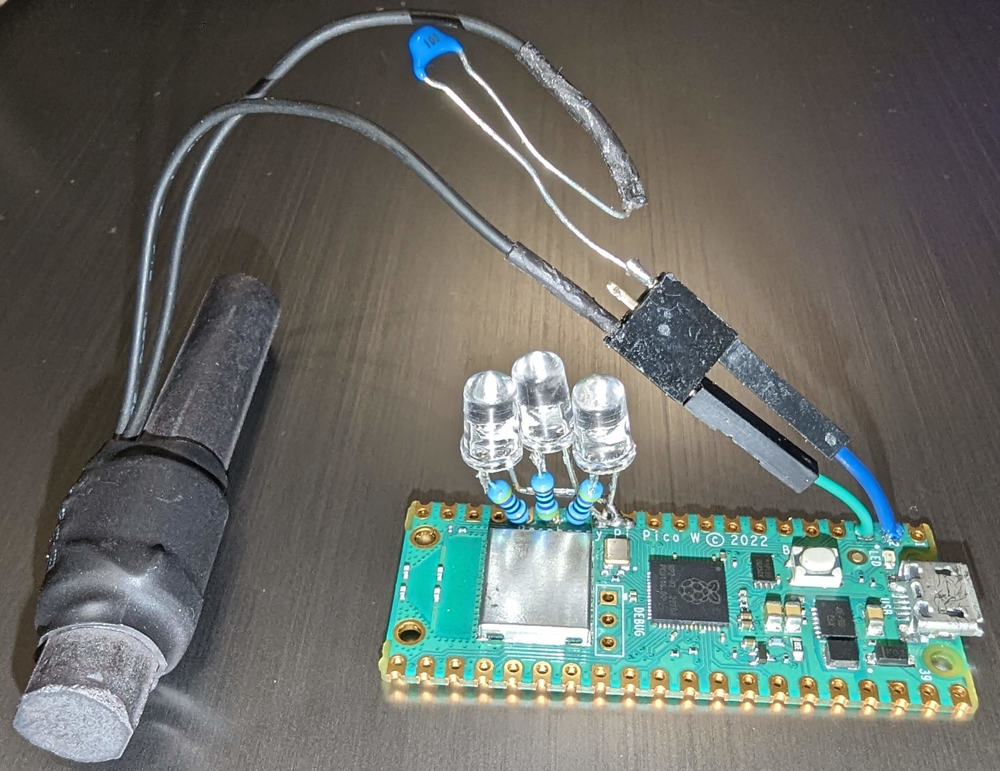

# pico wwvb

Pico wwvb is a single board computer which gets the time via NTP and transmits a WWVB signal to synchronize radio controlled clocks.

It uses the [Raspberry Pi Pico W](https://www.raspberrypi.com/documentation/microcontrollers/raspberry-pi-pico.html), and doesn't require making a printed circuit board.

This is a simplification of a previous project which used GPS to obtain the time.  See [micro-wwvb](https://github.com/chgenly/micro-wwvb).

PICO W board showing LEDs and antenna connection

PICO W with antenna 

# Windows Development environement

As described in [Getting Started With Raspberry Pi Pico](https://datasheets.raspberrypi.com/pico/getting-started-with-pico.pdf?_gl=1*1nfvcz8*_ga*MzMwNzAxMjUzLjE3MDExNDE3NTA.*_ga_22FD70LWDS*MTcwMTE5ODg2Mi4zLjEuMTcwMTIwMDY5Ny4wLjAuMA..)

Download the latest
release of [Pico setup for windows](https://github.com/raspberrypi/pico-setup-windows/releases/latest/download/pico-setup-windows-x64-standalone.exe)
and run it.

In your Start Menu, look for the *Pico - Visual Studio Code* shortcut,
in the *Raspberry Pi Pico SDK \<version\>* folder. The shortcut sets up
the needed environment variables and then launches Visual Studio Code.

Open the pico-wwvb folder.

Open the cmake view.  In the project outline find pico-wwvb